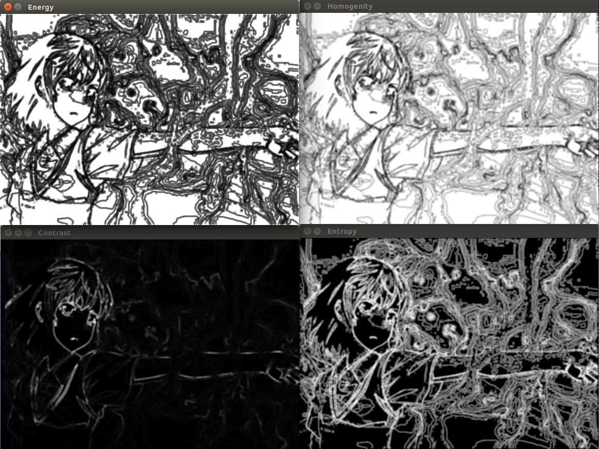

This repository is the C++ Source Code of GLCM, which is based on OpenCV libraries after I learn about the theory of GLCM (Gray-level Co-occurrence Matrix).

# GLCM's Theory
I wrote a blog about GLCM's theory. And here is the web address:
http://blog.csdn.net/ajianyingxiaoqinghan/article/details/71552744

# Files Introduction

- src - Source Codes' Path
	- glcm.h - GLCM algorithm's head file source code
	- glcm.cpp - GLCM algorithm's C++ source code
	- main.cpp - GLCM algorithm's test program's source code
- lib - the Generating Path of  Dynamic-Link Library
- image - the Path of Images for Algorithm Test Program
- CMakeLists.txt - CMake File of this Project

# Tutorial for Generating this Project
## 1. My Working Environment

- Operating System: Ubuntu 14.04 LTS
- OpenCV Version: 2.4.9
- Conditions before your cmake command:
	- have already done OpenCV's make & make install
	- have already done CMake's make & make install

Besides, I also wrote the tutorial blog of how to install OpenCV 2.4.9 in Ubuntu 14.04. Here are the websites: 
CSDN：http://blog.csdn.net/ajianyingxiaoqinghan/article/details/62424132
GitHub：https://github.com/upcAutoLang/Blog/issues/1

## 2. CMake this Project
Open a terminal and enter in the path of folder named *GLCM_OpenCV*, then input commands like below:
```bash
cmake ./
make
```
Then you will build this project.

The path of binary files - /GLCM_OpenCV/build/bin 
The path of library files - /GLCM_OpenCV/build/lib

# Test Results
I run the algorithm test program by using image whose path is */GLCM_OpenCV/image/miska.jpg*, and the result is like below:


the result of **Debug Version**:
```cpp
Time of Magnitude Gray Image: 1.38906ms
Time of Calculate Texture Features of the whole Image: 4126.57ms
```
the result of **Release Version**:
```cpp
Time of Magnitude Gray Image: 0.452412ms
Time of Calculate Texture Features of the whole Image: 1291.15ms
```

